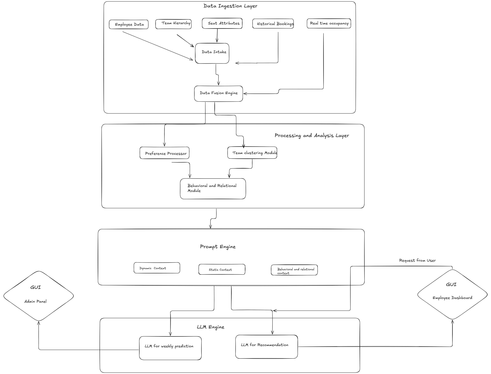
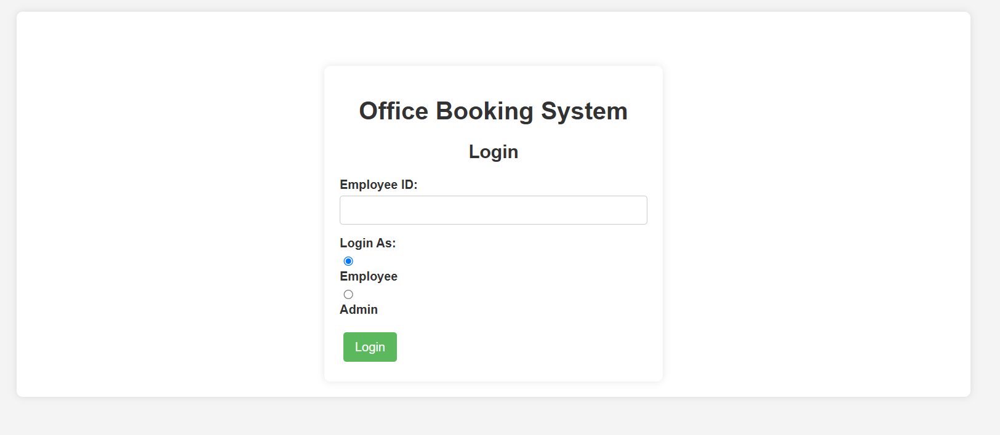
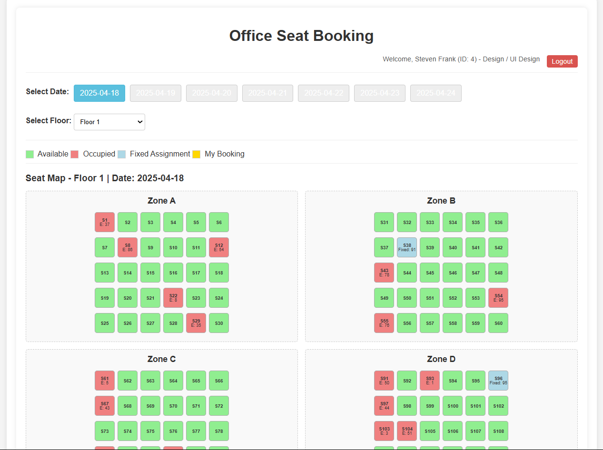

# Smart Office Booking AI 🏢🤖

**The Adaptive Office Seat Booking System: Intelligent Seat Reservations Powered by LLMs**

[](https://opensource.org/licenses/MIT) <!-- Optional: Add badges for license, build status etc. -->

## Overview

The Smart Office Booking AI system is an intelligent, AI-powered solution designed to streamline the office seat reservation process for employees. It features an interactive frontend for easy seat selection and leverages a sophisticated Large Language Model (LLM) working in the background to recommend the most suitable available seats based on user preferences, historical behavior, team relationships, real-time availability, and company policies.

This system moves beyond simple reservation tools by providing a seamless, personalized, and adaptive seat management experience, making the booking process efficient, fair, and user-friendly.

## Why Use an LLM for Seat Booking?

Integrating an LLM offers significant advantages over traditional booking systems:

*   **Reduces Manual Effort:** Eliminates the need for employees to manually sift through floor plans to find a suitable seat.
*   **Deep Preference Understanding:** Learns and adapts to individual user preferences over time (e.g., proximity to windows, quiet zones, specific colleagues).
*   **Policy Compliance:** Automatically considers and enforces seating policies (team zones, capacity limits, fixed assignments).
*   **Intelligent Alternatives:** Suggests the best alternative options when preferred seats are unavailable, minimizing disruption.
*   **Conflict Resolution:** Handles potential booking conflicts intelligently.

## Key Features

*   **Interactive Frontend:** User-friendly interface (e.g., floor map) to visualize seat availability and make selections.
*   **LLM-Powered Recommendations:** Background LLM analyzes data to suggest optimal seats tailored to the user.
*   **Real-Time Updates:** Seat availability is updated instantly across the system.
*   **Preference Learning:** Adapts suggestions based on user's past booking history and stated preferences.
*   **Policy Enforcement:** Ensures bookings adhere to company guidelines.
*   **Conflict Handling:** Provides immediate alternative suggestions if a chosen seat becomes unavailable.
*   **Admin Dashboard:** (Implied from project structure) Allows administrators to manage the system and potentially view analytics/visualizations.

## System Architecture


The system comprises several key components:

1.  **Frontend UI:**
    *   Provides an interactive seat selection interface (floor map visualization).
    *   Displays real-time seat status (Available, Occupied, My Booking, Fixed).
    *   Communicates with the Backend APIs.

2.  **Backend APIs (Flask):**
    *   Manages business logic, user sessions, and data interactions.
    *   Handles requests from the frontend.
    *   Interfaces with the LLM Processing Unit for recommendations and decisions.
    *   Updates seat availability and booking records in the data store.

3.  **LLM Processing Unit (Google Gemini via API):**
    *   Receives context (user info, preferences, date, requested action, current seat status) from the Backend.
    *   Analyzes the request against historical data, preferences, team relationships, and availability.
    *   Returns a decision (`confirmed`/`denied`), a `reason`, and potentially a `recommended_seat`.
    *   **Note:** The LLM works *in the background* to provide intelligent suggestions and decisions, not as a user-facing chatbot.

4.  **Data Storage (Pandas DataFrames - In-Memory):**
    *   Currently utilizes Pandas DataFrames loaded at startup for:
        *   `Users`: Employee profiles, department, team, preferences.
        *   `Seats`: Layout details (floor, zone, row, attributes), fixed assignments.
        *   `Bookings`: Historical booking records (can be extended to store current web bookings).
        *   `Hierarchy`: Manager-subordinate relationships.
    *   Ensures fast data access for real-time operations during the application's runtime. (Note: For persistent storage in production, a database like PostgreSQL or MySQL would be recommended).

## Workflow Overview

This system follows a structured user journey:

1.  **Login:** 
Employee can login with employee_id and Admin can login admin_id


2.  **Access Booking Interface:** User navigates to the seat booking page, selecting a date and floor.

3.  **View Seat Map:** The frontend displays the seat map for the selected date/floor, showing real-time availability based on data fetched from the backend (which considers fixed assignments, simulated occupancy, and web bookings).

4.  **Select Seat:** User clicks on an available seat *or* a seat they have already booked (to cancel).
5.  **Backend Request:** The frontend sends a request to the backend API (`/api/book`) with the user ID, seat ID, date, and action (`book` or `cancel`).
6.  **LLM Consultation:**
    *   The backend prepares static and dynamic context (including current seat status, user profile/preferences, relationships).
    *   The backend calls the LLM, providing the context and the user's request.
7.  **LLM Decision & Recommendation:**
    *   The LLM analyzes the request based on the provided data and rules.
    *   It returns a JSON response indicating if the action is `confirmed` or `denied`, a `reason`, and if denied, potentially a `recommended_seat` alternative.
  
   
8.  **Backend Processing:**
    *   If **confirmed**, the backend updates the in-memory booking store for the web session.
    *   If **denied**, the backend relays the denial reason and any recommendation to the frontend.
9.  **Frontend Update:**
    *   If **confirmed**, the frontend refreshes the seat map to reflect the successful booking/cancellation. A success message is shown.
    *   If **denied**, the frontend displays the denial reason. If a recommendation was provided, it may prompt the user to book the recommended seat.
10. **Confirmation:** User sees the updated seat map and receives feedback (alert/message) about the outcome of their request.

## How the LLM Assists

Instead of a direct chat interface, the LLM acts as an intelligent decision-making engine in the background:

*   **Understands Preferences:** Interprets stored preferences (window, quiet zone, near team/manager, floor/zone) and historical choices.
*   **Contextual Awareness:** Considers the specific date, day of the week, and real-time availability provided by the backend.
*   **Relationship Analysis:** Uses graph data to understand team and manager proximity for relevant recommendations.
*   **Handles Conflicts & Suggests Alternatives:** If a requested seat isn't suitable (occupied, policy violation), the LLM identifies the *next best available* alternative based on the user's profile and current availability.

## Detailed LLM Processing Logic (on `/api/book` call)

When a user requests to book or cancel a seat:

1.  **Receive Request:** Backend receives `employee_id`, `seat_id`, `date`, `action`.
2.  **Gather Context:** Backend retrieves:
    *   Static Context (Office layout, general policies).
    *   Dynamic Context for the `date` (Current combined seat availability snapshot, relevant historical patterns for that weekday).
    *   Specific User Context (Preferences, team, manager, relationships from graph).
3.  **Invoke LLM:** Backend sends the context and request details to the LLM.
4.  **LLM Analysis:** The LLM evaluates:
    *   **Availability:** Is the `seat_id` available in the provided snapshot? Is it a fixed assignment?
    *   **Permissions:** (Implicitly handled by login, but LLM could check for specific role needs if required).
    *   **Preference Match:** How well does the `seat_id` match the user's preferences and historical behavior?
    *   **Action Logic:**
        *   **If `action == 'book'`:**
            *   If seat is unavailable/fixed: **Deny**. Suggest best available alternative based on preferences.
            *   If seat is available: **Confirm**.
        *   **If `action == 'cancel'`:**
            *   If seat is booked by this user (check done primarily by backend before LLM call, but LLM confirms logic): **Confirm**.
            *   If seat is not booked by user/already available: **Deny** (or confirm cancellation as idempotent).
5.  **LLM Response:** LLM returns JSON: `{ "action_status": "confirmed/denied", "reason": "...", "recommended_seat": "seat_id_or_none" }`
6.  **Backend Action:** Backend interprets the response and updates the web booking state *only if confirmed*.

## Adaptive Features

The system continuously learns and adapts:

*   **Personalization:** Refines seat recommendations based on individual user booking habits and implicit preferences derived from choices.
*   **Dynamic Adjustments:** While not fully implemented with Pandas, the *potential* exists to adapt allocations based on predicted demand for high-occupancy days (using the prediction feature).
*   **Automated Conflict Resolution:** If the LLM denies a seat, it instantly suggests alternatives, minimizing user friction.

## API Endpoints

Key backend API endpoints include:

*   `GET /api/availability?date=YYYY-MM-DD`: Returns the current state (availability, occupant) of all seats for the specified date, combining base data, fixed assignments, and web bookings.
*   `POST /api/book`: Handles booking/cancellation requests. Consults the LLM for a decision and updates the state if confirmed. Requires JSON body: `{ "seat_id": <int>, "date": "YYYY-MM-DD", "action": "book" | "cancel" }`.
*   `GET /api/office_layout`: Provides basic layout information (floors, zones).
*   `POST /api/admin/trigger_predictions` (Admin): Triggers the LLM-based weekly seat occupancy prediction process.
*   `GET /admin/graphs` (Admin): Displays network graphs showing employee relationships.

<!--
## Database Schema (Conceptual for Pandas DataFrames)

*   **Employees (`employees_df`):** `employee_id` (PK), `name`, `department`, `team`, `seniority`, `work_days` (list), `preferences` (dict)
*   **Hierarchy (`hierarchy_df`):** `employee_id` (FK), `manager_id` (FK), `team`, `department`
*   **Seats (`seats_df_base`):** `seat_id` (PK), `floor`, `zone`, `row`, `seat_number`, `is_window`, `is_quiet_zone`, etc., `fixed_assignment` (FK to employee_id or None)
*   **Bookings (`booking_history_df` / `real_time_bookings_store`):** `booking_id` (PK, if relational), `date`, `employee_id` (FK), `seat_id` (FK), `booking_time`, `attended`, `cancelled` / In-memory: `{ date_str: { seat_id: employee_id } }`
-->

## Security Considerations

*   **Authentication:** Simple Employee ID based login. User type (Employee/Admin) determines access.
*   **Authorization:** Route decorators (`@login_required`, `@admin_required`) protect endpoints based on user type in the session.
*   **Input Validation:** Basic validation on API inputs (e.g., date format, numeric IDs).

## Scalability Considerations

*   **Data Storage:** Current Pandas implementation is suitable for demos/small scale. For larger deployments, migrate to a relational database (e.g., PostgreSQL) or NoSQL DB.
*   **LLM API Calls:** API calls can be a bottleneck. Consider caching LLM responses for identical, non-time-sensitive requests (if applicable). Monitor API usage costs.
*   **Backend:** Flask can scale, but for very high traffic, consider asynchronous frameworks or deploying multiple instances behind a load balancer.
*   **Real-Time Updates:** Current in-memory store is simple. For multi-instance deployments, a shared cache (Redis) or database locks would be needed for consistent real-time state.

## Screenshots

1.  **Employee Booking Dashboard:** Shows the main seat selection interface with the floor map, date/floor selectors, and legend.
     <!-- Replace with actual image path -->

2.  **LLM Recommendation - Scenario 1 (Seat Unavailable):** Shows an alert or modal after a user clicks an occupied seat, displaying the LLM's denial reason and a suggested alternative seat.
     <!-- Replace with actual image path -->

3.  **LLM Recommendation - Scenario 2 (Booking Confirmed):** Shows a success message after a booking is confirmed by the LLM and backend.
     <!-- Replace with actual image path -->

## Technology Stack

*   **Backend:** Python, Flask
*   **Frontend:** HTML, CSS, JavaScript (jQuery used in example)
*   **AI/LLM:** Google Gemini API (via `google-generativeai` library)
*   **Data Handling:** Pandas
*   **Graph Analysis:** NetworkX
*   **Plotting (Admin):** Matplotlib

## Getting Started

*(TODO: Add instructions on how to set up the environment, install dependencies, configure API keys, and run the application locally.)*

```bash
# Example steps (replace with actual commands)
git clone https://github.com/your-username/smart-office-booking-ai.git
cd smart-office-booking-ai
python -m venv venv
source venv/bin/activate # or venv\Scripts\activate on Windows
pip install -r requirements.txt
# Configure your Google API Key (e.g., set GOOGLE_API_KEY environment variable or update in code)
# Set FLASK_SECRET_KEY environment variable
flask run
